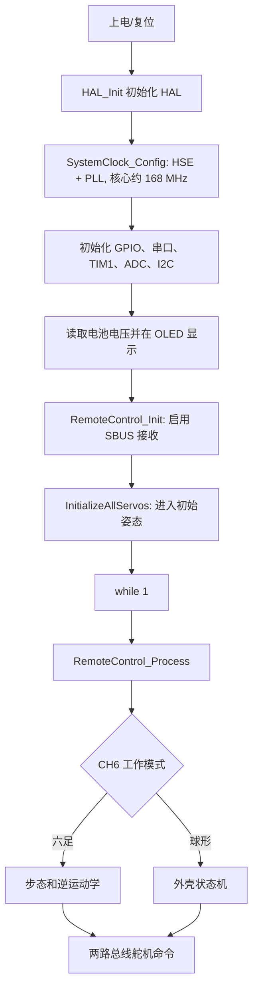

# Hexapod STM32 入门报告

> 面向第一次接触 STM32、做过简单 Arduino / Python 小程序的读者。本文基于 `hexapod/` 目录中 **43 个 `.c` 文件**整理，目标是帮助你建立全局认识、完成第一次安全编译，并能开始有计划地复刻，而不是要求你立刻读懂全部代码。

## 0. 先给结论

这是一个以 **STM32F407ZGT6** 为主控的六足/变形球机器人项目。它用两个串口总线分别控制两组总线舵机，用一个 PWM 通道控制中央普通舵机；遥控器以 SBUS 串口数据输入；代码根据摇杆数据选择六足步态或球形动作。

你现在的第一目标不是改步态，也不是给整机通电，而是：

1. 在 CubeIDE 中让项目无错误编译。
2. 搞清楚一个“摇杆命令 -> 串口命令 -> 一个舵机动作”的完整链路。
3. 只接主控和 **一个** 已知 ID、已知供电方式的舵机，做小角度测试。
4. 再扩展为一条腿、六条腿，最后才考虑外壳和球形动作。

## 1. 从 Arduino / Python 过渡到 STM32

| 你熟悉的概念 | 在本工程里的对应物 | 需要建立的新认识 |
| --- | --- | --- |
| `setup()` | `main()` 中初始化部分 | 先配置时钟、外设，再开始业务逻辑。 |
| `loop()` | `while (1)` | 循环本身很简单，复杂处在中断、串口和状态机。 |
| `Serial` | `USART1/2/3/6`、`UART4` | 每一路串口的引脚、波特率和用途都必须一致。 |
| `analogRead()` | `HAL_ADC_Start` / `HAL_ADC_GetValue` | ADC 读回的是数字采样值，要再换算电压。 |
| `Servo.write()` | PWM 或总线舵机协议 | 本项目两种舵机控制方式并存，不能混用。 |
| 安装库 | `Drivers/`、头文件 `#include` | HAL 库和项目自定义驱动会一起参与编译。 |

STM32 工程的一个关键区别：配置不仅在 C 文件里，还在 `hexapod.ioc`。它是 CubeMX/CubeIDE 的配置来源，用于记录芯片、时钟、引脚和外设；修改它之后，IDE 可能会重新生成 `Core/Src` 的部分代码。带有 `USER CODE BEGIN/END` 标记的区域通常才适合手工保留代码。

## 2. 代码的四层地图

```text
遥控器 SBUS
    -> USART6 中断
    -> sbus.c 解包 25 字节数据
    -> hexapod_remote_control.c 解释摇杆/模式
    -> hexapod_control.c 或 sphere_control.c
    -> servo.c (USART2) / servo2.c (USART3) / TIM1 PWM
    -> 舵机、腿、外壳

main.c 同时负责：芯片启动、外设初始化、电池电压显示、调用遥控处理
```

目录分层：

| 层级 | 位置 | 应该怎样阅读 |
| --- | --- | --- |
| 项目机器人逻辑 | `Drivers/hexapod/` | 最重要，先读。这里决定机器人怎么动。 |
| STM32 应用入口和外设初始化 | `Core/Src/` | 第二优先，理解引脚和外设如何启用。 |
| ST 官方 HAL 驱动 | `Drivers/STM32F4xx_HAL_Driver/Src/` | 不要逐行读；知道它是底层工具箱即可。 |
| 旧实验入口 | `save/main.c` | 仅作 SBUS 调试参考，不是现在的主程序。 |

## 3. 上电后，代码实际怎样运行

当前主入口是 `Core/Src/main.c`。执行顺序如下：



注意：`main.c` 中 `Servo_Process()` 和 `Sphere_Process()` 目前是注释掉的。也就是说，球形模式的一些“持续滚动维持”逻辑目前不一定会在主循环中运行。这是后续需要验证的项目现状，不要在第一次上电时假设球形动作完整可用。

## 4. 硬件接口表

| 外设 | 芯片引脚 | 代码中的用途 | 初学阶段要做什么 |
| --- | --- | --- | --- |
| USART1 | PA9 / PA10, 115200 | `printf` 调试信息 | 用 USB 转串口查看日志。 |
| USART2 | PA2 / PA3, 115200 | `servo.c` 左侧/第一路总线舵机 | 先确认实际接线、总线电平和 ID。 |
| USART3 | PB10 / PB11, 115200 | `servo2.c` 右侧/第二路总线舵机 | 不要和 USART2 对调。 |
| USART6 | PC6 / PC7, 100000，9 位、偶校验、2 停止位 | SBUS 遥控接收 | 普通 115200 串口设置不能代替它。 |
| UART4 | PA1 / PC10 | 已初始化，当前主逻辑用途不突出 | 暂不作为学习重点。 |
| I2C1 | PB6 / PB7 | SSD1306 OLED | 可后置，故障不影响先理解腿部算法。 |
| ADC1 | PA5 | 电池电压采样 | 接入前必须核对分压电路，不可将电池电压直接接芯片。 |
| TIM1 CH1 | PA8 | S80 中央普通舵机 PWM | 与总线舵机完全不同的控制路径。 |

## 4.1 除了 `.c` 以外，工程中还要认识哪些文件

下面按“你是否需要亲自打开和修改”分类。先记住：文件多不代表你都要读；STM32 工程会把源码、芯片启动信息、IDE 配置和每次编译的临时结果放在同一个项目里。

| 文件或目录 | 本项目中的例子 | 是什么 | 你现在该怎样做 |
| --- | --- | --- | --- |
| `.c` | `main.c`、`servo.c` | C 源文件，是真正的实现代码 | 重点读；自己的功能通常写在这里。 |
| `.h` | `servo.h`、`hexapod_control.h` | 头文件：函数声明、结构体、常量和模块接口 | 与同名 `.c` 配对读；修改接口时才改。 |
| `.ioc` | `hexapod.ioc` | CubeMX 的图形化硬件配置：芯片、引脚、时钟、外设 | 必须认识；改串口/引脚/时钟时在 CubeIDE 的 `.ioc` 编辑器中改。 |
| `.s` | `Core/Startup/startup_stm32f407zgtx.s` | ARM 汇编启动文件；复位后设栈、初始化内存并跳到 `main()` | 知道它存在即可，不修改。 |
| `.ld` | `STM32F407ZGTX_FLASH.ld`、`STM32F407ZGTX_RAM.ld` | 链接脚本，规定 Flash/RAM 的地址和程序各段如何摆放 | 不修改；换芯片或排查内存溢出时才需要。 |
| `.project` | 根目录 `.project` | Eclipse/CubeIDE 的项目身份与构建器定义 | 不手改；导入工程时 IDE 使用它。 |
| `.cproject` | 根目录 `.cproject` | CubeIDE 的编译器、包含路径、宏、链接脚本与 Debug 构建设置 | 不手改；通过 Project Properties 修改设置。 |
| `.mxproject` | 根目录 `.mxproject` | CubeMX/CubeIDE 的生成器元数据 | 不手改，和 `.ioc` 一起保留。 |
| `.launch` | `hexapod Debug.launch` | 运行/调试启动方案，记录烧录、复位、断点和调试器选项 | 需要烧录时在 IDE 的 Debug Configurations 中核对。 |
| `.cfg` | `hexapod Debug.cfg`、`hexapod Debug2.cfg` | OpenOCD 调试服务器配置，规定调试器接口、芯片和 SWD 连接方式 | 正常不编辑；必须让它和你实际调试器匹配。 |
| `Drivers/CMSIS/` | `core_cm4.h`、`stm32f407xx.h` | ARM/ST 提供的内核和芯片寄存器定义 | 不改；它比 HAL 更靠近芯片。 |
| `Drivers/STM32F4xx_HAL_Driver/` | `stm32f4xx_hal_uart.*` 等 | ST 官方外设驱动库 | 不改；在调用处需要时再查看。 |
| `Debug/` | `makefile`、`.o`、`.d`、`.su`、`.cyclo` | IDE 自动生成的 Debug 构建目录 | 不手改，不作为源码阅读。 |

### `.cfg` 在这个项目里具体代表什么

两个 `.cfg` 都是 OpenOCD 的调试器配置，但接口不同：

| 文件 | 配置的调试器接口 | 适用情况 |
| --- | --- | --- |
| `hexapod Debug.cfg` | `stlink-dap.cfg`，即 ST-Link DAP | 你使用 ST-Link 调试器时应选择/生成对应配置。 |
| `hexapod Debug2.cfg` | `cmsis-dap.cfg`，即 CMSIS-DAP | 只有你实际使用 CMSIS-DAP 调试器时才适用。 |

当前 `hexapod Debug.launch` 指向的是 `hexapod Debug2.cfg`，也就是 CMSIS-DAP。这不影响单纯 Build，但以后点 Debug/烧录时，如果你买的是 ST-Link，可能会连接失败。届时不要直接改文本；在 CubeIDE 的 **Run -> Debug Configurations** 中选择正确探针类型，或新建 ST-Link 配置。

### `Debug/` 中的后缀到底是什么

| 后缀 | 含义 | 要不要提交/修改 |
| --- | --- | --- |
| `.o` | 某个 `.c` 编译出来的目标文件 | 不改；可由源码重新生成。 |
| `.d` | 依赖关系：该源文件包含了哪些头文件 | 不改。 |
| `.su` | 编译器输出的栈使用信息 | 不改；深入排查栈溢出时才看。 |
| `.cyclo` | 函数圈复杂度的分析数据 | 不改；当前学习阶段可忽略。 |
| `.mk` / `makefile` | Make 构建规则 | 通常由 CubeIDE 生成，不手改。 |
| `.elf` | 编译和链接成功后的调试固件，Debug 配置会烧录它 | 要认识，但不编辑。 |
| `.map` | 链接内存分布报告，可用于排查 Flash/RAM 不够 | 编译成功后才会出现；不编辑。 |
| `.list` | 反汇编清单，可将机器指令对应到 C/汇编 | 初期不用看。 |

你目前的 `Debug/` 目录只有部分中间文件，说明之前的构建没有完整走到最终链接阶段；因此看不到可供烧录的完整 `hexapod.elf` 是正常现象。先解决 Build 的红色 error，成功后 IDE 会自动生成它。

### 哪些文件通常应该跟 Git 一起保存

应保留：自己的 `.c`、`.h`、`.ioc`、`.ld`、`.project`、`.cproject`、`.mxproject`、需要共享的 `.launch`、文档和硬件配置表。通常不需要提交：`Debug/` 里的 `.o`、`.d`、`.su`、`.cyclo`、自动生成的 `makefile`、`.elf`、`.map`、`.list`。后者既可以重新生成，也会让仓库变得杂乱。

## 5. 必须先读的 10 个自定义 C 文件

### `hexapod_control.c`：六条腿怎样走

这是六足模式的核心。每条腿按三个关节、三个自由度处理。`CalculateLegControl()` 的工作是把“脚想落到空间中的哪个位置”转换成三个舵机的目标位置：

```text
足端目标坐标 (x, y, z)
  -> 转到该腿的局部坐标系
  -> inverse_kinematics()
  -> 三个关节角 + 安装/零位偏移
  -> 舵机协议位置值
```

代码中定义了三角步态：

- 第一组：左前、右中、左后。
- 第二组：右前、左中、右后。
- 一组抬脚向前时，另一组支撑身体；然后交替。

参数例如 `L1=61.86 mm`、`L2=87.02 mm`、`L3=117.1 mm`、`BASE_RADIUS=134.45 mm`、步高 `40 mm`、步长 `50 mm` 都直接影响动作。**第一次不要改这些数值。**

`legServoIDs` 在注释里写明只是示例映射，必须依据你实际装配的总线舵机 ID 重建。它不是可直接照抄的硬件真相。

### `kinematics.c`：从坐标反推关节角

`inverse_kinematics()` 是逆运动学：输入目标脚尖 `(x, y, z)`，输出髋关节、股关节、胫关节的角度。数学上会用到三角函数和余弦定理。

第一次学习只需要知道“输入是位置、输出是角度”，无需急着推导公式或改公式。真正容易让硬件撞限位的通常是零位、正反方向、ID 映射和机械尺寸，不是这段数学本身。

### `robot_initialization.c`：如何安全进入初始姿态

`InitializeAllServos()` 以分步骤、带延时的方式给舵机发送初始姿态，`TestAllServos()` 可用于逐个小幅测试。这是你第一次硬件调试最值得借鉴的文件。

文件的设计目标写为 18 个腿部舵机 + 12 个外壳舵机 + 1 个中央舵机。这个数量与其他文件并不完全一致，见第 9 节。首次实验请从这个文件中抽取“只动一个舵机”的思想，而不要直接运行整套初始化。

### `servo.c` 和 `servo2.c`：两条总线舵机驱动

两个文件结构非常相似：

| 文件 | 底层串口 | 作用 |
| --- | --- | --- |
| `servo.c` | USART2 | 一路总线舵机协议、批量位置命令、ID/模式/温度/电压等操作；也包含 TIM1 的普通 PWM 舵机控制。 |
| `servo2.c` | USART3 | 第二路总线舵机协议，主要供另一半机构使用。 |

重点函数包括 `Servo_SetMultiPosition()` / `Servo2_SetMultiPosition()`，它们把多个 ID、目标位置和运动时间打包成串口数据帧。`Servo_SetAngle()` 则是中央 PWM 舵机，不是总线协议。

### `sbus.c`：把遥控信号解码成通道值

SBUS 每帧 25 字节。这个文件把压缩的位数据解出各通道，并提供映射工具函数。看懂它能帮助你理解为什么遥控器串口不是普通 `115200, 8N1`。

### `hexapod_remote_control.c`：遥控动作分发

该文件通过 USART6 的中断接收 SBUS 缓冲，并把通道解释成命令。CH5 映射为舵机运动时间，CH6 用作模式切换，含展示、六足、球形等状态。摇杆命令最终会调用步态或球形控制函数。

### `sphere_control.c`：外壳状态机和球形动作

它维护 `IDLE`、`TRANSFORMING`、`SPHERE`、`HEXAPOD`、`DISPLAY` 等状态，把外壳分为左右两半，各走不同总线。代码定义 12 个切片，每个切片两个外壳舵机。

球形滚动由分组伸缩动作组成。源代码自身标注 `Sphere_StretchRight()`、`Sphere_StretchLeft()` “有 BUG，暂时用不了”。因此它不是第一阶段调试目标。

### `oled.c` 与 `font.c`：显示，不是运动核心

`oled.c` 是 SSD1306 的 I2C 显示驱动，显示电压和状态；`font.c` 主要是字模数据。它们可以最后再看，暂不值得为显示问题阻塞六足调试。

## 6. `Core/Src` 的 11 个 C 文件

| 文件 | 职责 | 你现在要读到什么程度 |
| --- | --- | --- |
| `main.c` | 启动顺序、初始化、主循环 | 必读，先读完整流程。 |
| `adc.c` | ADC1 与 DMA/采样配置 | 知道其为电池电压输入即可。 |
| `gpio.c` | 引脚模式、初始电平 | 需要时用来核对某个引脚。 |
| `i2c.c` | I2C1 初始化 | 知道它供 OLED 用。 |
| `tim.c` | TIM1 PWM 初始化 | 重点理解中央 S80 舵机的频率和占空比。 |
| `usart.c` | 五路串口初始化 | 必读，用它核对每一路的用途和参数。 |
| `stm32f4xx_it.c` | 中断服务函数 | 知道 UART 接收中断从这里进入。 |
| `stm32f4xx_hal_msp.c` | HAL 底层时钟、GPIO、DMA/NVIC 钩子 | 初期只需知道它让外设真正连到引脚/中断。 |
| `system_stm32f4xx.c` | 系统启动、时钟相关基础 | 不改。 |
| `syscalls.c` | `printf` 等 C 库系统调用重定向支持 | 不改，调试串口异常时再回来看。 |
| `sysmem.c` | 堆内存支持 | 初期不改。 |

## 7. 官方 HAL 的 21 个 C 文件：不用逐行读

`Drivers/STM32F4xx_HAL_Driver/Src/` 共 21 个文件、约 3.3 万行。它们是 ST 提供的通用外设库，负责把类似 `HAL_UART_Transmit()` 的调用转换为寄存器操作。对本项目来说，它们是“已安装的官方工具箱”，不是当前要复刻的机器人算法。

| 分类 | 文件 |
| --- | --- |
| ADC / DMA | `stm32f4xx_hal_adc.c`, `stm32f4xx_hal_adc_ex.c`, `stm32f4xx_hal_dma.c`, `stm32f4xx_hal_dma_ex.c` |
| GPIO / EXTI | `stm32f4xx_hal_gpio.c`, `stm32f4xx_hal_exti.c` |
| I2C | `stm32f4xx_hal_i2c.c` |
| 串口 | `stm32f4xx_hal_uart.c`, `stm32f4xx_hal_uart_ex.c` |
| 定时器 | `stm32f4xx_hal_tim.c`, `stm32f4xx_hal_tim_ex.c` |
| 时钟 / 电源 / Flash | `stm32f4xx_hal_rcc.c`, `stm32f4xx_hal_rcc_ex.c`, `stm32f4xx_hal_pwr.c`, `stm32f4xx_hal_pwr_ex.c`, `stm32f4xx_hal_flash.c`, `stm32f4xx_hal_flash_ex.c` |
| 内核 / 系统 | `stm32f4xx_hal.c`, `stm32f4xx_hal_cortex.c`, `stm32f4xx_hal_iwdg.c`, `stm32f4xx_hal_pcd.c`, `stm32f4xx_hal_pcd_ex.c` |

在调用处按 `Ctrl` + 点击函数进入 HAL 看一小段即可；不要为了“读完所有代码”陷进其中。

## 8. `save/main.c` 是什么

`save/main.c` 是一个保存在 `save/` 里的旧版/实验性入口，约 289 行，重点是 SBUS 接收与调试。编译当前工程时真正被使用的入口仍是 `Core/Src/main.c`。看它可以帮助理解早期试验过程，但不要同时修改两个 `main.c`，否则容易产生“改了却没有效果”的困惑。

## 9. 目前必须记录的风险和不一致

这些问题来自现有代码与资料本身。现在先记录、后续逐项实测，不要为了消除警告而盲改。

1. **舵机总数不一致。** 根目录资料/BOM 写 30 个 ZX20D + 1 个 S80；`robot_initialization.c` 写 18 腿 + 12 壳 + 1 中央 = 31；`sphere_control.h` 又按 12 切片 x 2，描述了 24 个外壳舵机版本。购买和接线前必须先确定你准备复刻哪个机械版本。
2. **ID 映射可能重叠。** `hexapod_control.c` 与 `sphere_control.c` 中都有“按实际硬件修改”的 ID 表，部分范围并不天然可信。总线舵机同一条总线上 ID 必须唯一。
3. **编译警告需要之后修正。** 包括把 `270` 赋给 `uint8_t` 导致截断为 `14`，以及 `sscanf` 的格式与 `uint8_t` / `uint16_t` 指针不匹配。它们可能导致球壳角度或串口解析异常。
4. **阻塞式动作较多。** 大量 `HAL_Delay()` 会在动作期间暂停处理器，遥控响应可能不及时；初学阶段先理解它，后续再改成基于 `HAL_GetTick()` 的非阻塞状态机。
5. **主要是开环控制。** 现有代码没有看到 IMU 或足端力传感闭环；效果高度依赖机械装配、零位校准、重心和电源。
6. **球形伸展已有已知 Bug。** 源码已标注 `Sphere_StretchRight/Left` 暂不可用，先不要测试。

### 已完成的最小编译修复

`Drivers/hexapod/hexapod_control.c` 使用了 `Servo2_SetMultiPosition()`，但原先没有包含声明它的 `servo2.h`，会出现“未声明”错误。已在该文件开头添加：

```c
#include "servo2.h"
```

这只解决一个头文件声明问题，没有改动任何控制算法。你仍要在 CubeIDE 中重新 Build，检查是否还有其他错误或警告。

## 10. 推荐的第一周阅读与实践顺序

| 阶段 | 阅读/操作 | 完成标准 |
| --- | --- | --- |
| 第 1 天 | `main.c`、`usart.c`、`tim.c` | 能说出每一路串口分别接什么。 |
| 第 2 天 | `robot_initialization.c`、`servo.c` | 能解释一条总线舵机命令至少包含 ID、位置、时间。 |
| 第 3 天 | `sbus.c`、`hexapod_remote_control.c` | 能解释遥控通道如何进入代码。 |
| 第 4 天 | `hexapod_control.h/.c` | 能画出三角步态的两组腿。 |
| 第 5 天 | `kinematics.c` | 知道逆运动学的输入和输出，不改公式。 |
| 第 6-7 天 | `sphere_control.c`、OLED | 只建立认识，暂不让球形机构全速运行。 |

## 11. 第一次硬件调试路线


硬件安全规则：

- 舵机不能从 STM32 板子的 3.3V/5V 小电源脚直接供电；使用按舵机规格匹配的独立大电流电源。
- 主控地线和舵机电源地线需要共地，否则串口信号没有可靠参考。
- 每次首次测试只用低速、小范围、可随时断电的姿态，手不要放在关节和连杆运动范围内。
- 没有核实 ID、机械限位和方向前，不要执行 `InitializeAllServos()`，更不要接满整机上电。

## 12. CubeIDE 中你现在应该怎样做

1. 在 Project Explorer 选中 `hexapod` 项目，右键选择 **Refresh**。
2. 选择 `Project -> Build Project`，或按 `Ctrl+B`。
3. 若报错，复制 **第一条红色 error** 及其前后几行；warning 可以先记录，但不能忽略数值截断和格式不匹配这类警告。
4. 编译成功只说明 C 代码、头文件和链接关系通过了，**不代表接线、供电、舵机 ID 或机械动作安全**。
5. 真正接硬件前，先把每个舵机的“物理位置、总线、ID、正反方向、零位、可用角度”记录成表，再让代码使用这张表。

## 13. 常用词汇扫盲

| 词汇 | 简单解释 |
| --- | --- |
| HAL | ST 的硬件抽象库，用函数替你操作 STM32 外设。 |
| CubeMX / `.ioc` | STM32 图形化配置工具和它的工程配置文件。 |
| 中断 | 外设有事时暂时打断主循环处理，例如串口收到了字节。 |
| UART / USART | 串口通信外设；本项目用它们接调试、总线舵机和遥控器。 |
| PWM | 周期脉冲，用高电平宽度表示普通舵机目标角度。 |
| ADC | 把模拟电压转换为数字值，本项目用于测电池电压。 |
| I2C | 两根信号线通信总线，本项目接 OLED。 |
| 编译 | 将 `.c` 源码翻译成目标文件。 |
| 链接 | 把各目标文件和库组合为一个可执行固件。 |
| ELF | 编译后的调试固件文件，包含符号信息。 |
| 烧录 | 用 ST-Link 等工具把固件写进芯片 Flash。 |
| ST-Link | STM32 常用下载与调试器。 |

## 14. 你暂时不要做的事情

- 不要为了“试试看”直接接满舵机并运行步态。
- 不要相信示例 ID 表就是你的接线表。
- 不要在没测一条腿前修改连杆长度、步高或步长。
- 不要把公式不理解当成当前阻碍；先完成单舵机和单腿校准。
- 不要手动修改官方 HAL 文件；项目逻辑应该优先放在 `Drivers/hexapod/` 或 `USER CODE` 区域。

## 15. 这份报告之后的第一件事

在 CubeIDE 执行一次 **Refresh -> Build Project**。若 Build 通过，下一步只做两件事：读 `Core/Src/main.c`，再结合本报告第 3 和第 4 节写出“每个外设接在哪里、做什么”的自己的笔记。若 Build 未通过，把首条 error 发出来，再逐条解决。
