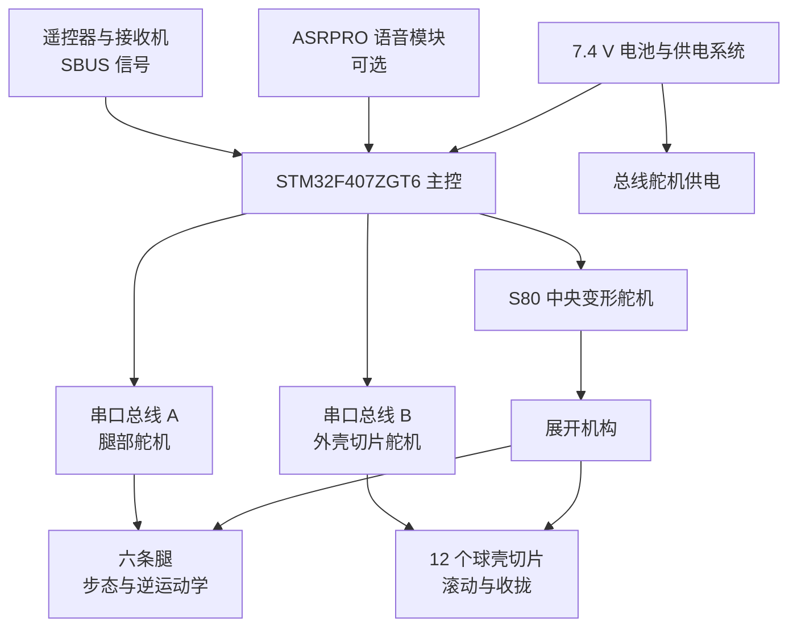
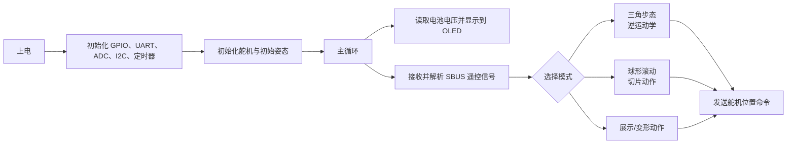
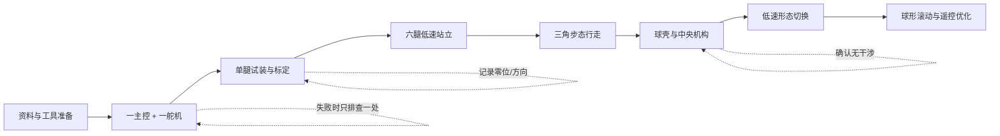

# MorpHex 复刻项目可视化报告

更新日期：2026-09-22  
适用分支：`my-rebuild`  
检查范围：仓库工作文件。已排除 Git 内部目录 `.git/` 与归档目录 `_archive/`。

## 一句话结论

这个仓库包含了机械模型、固件工程、物料清单和主要模块资料，足以作为个人学习复刻的起点；但它不是“下载后就能整机开机”的成品套件。最正确的第一目标是完成 **一台主控 + 一个总线舵机 + 单腿机械件** 的低风险台架验证，再逐步扩展。

整机复刻对初学者属于 **中高难度的机电一体化项目**。难点主要不在 Git，也不在复制代码，而在舵机编号/零位、机械装配公差和高电流供电。

## 项目是什么

原项目是一个可在两种形态间切换的机器人：

- **六足形态**：六条腿进行前后、横移和原地转向。
- **球形形态**：外壳切片协同动作，使机器人滚动。
- **变形机构**：中央高扭矩舵机驱动展开/收拢机构。
- **控制方式**：遥控器的 SBUS 信号为主，语音模块为可选功能。

根目录 `README.md` 声明的目标规格为：约 400 mm 球体直径、7.4 V / 9000 mAh 电池、30 个 ZX20D 总线舵机加 1 个 S80 高扭矩舵机。它们是原作者的设计目标和 BOM 依据，不是你当前已验证的实测结果。

## 系统组成图



## 仓库地图

```text
morphex-rebuild/
├─ README.md                 原项目说明、公开链接和目标参数
├─ BOM.xlsx                  43 项采购/加工物料清单
├─ 复刻项目可视化报告.md      本报告
├─ 3D建模/                   47 个 SolidWorks 零件、10 个装配体、6 个 STEP 文件
├─ hexapod/                  STM32CubeIDE 固件工程，可看到已生成的 ELF 文件
│  ├─ Core/                  MCU 初始化、外设配置和主循环
│  ├─ Drivers/hexapod/       10 组自定义控制模块：步态、舵机、球形、遥控等
│  └─ hexapod.ioc            STM32CubeMX 外设与芯片配置
├─ 资料/                     核心板、遥控接收机、语音模块等说明资料
├─ images/                   成品与结构示意图
├─ my-notes/                 你自己的长期复刻记录
├─ research/                 早期来源调研报告
└─ hexapod.rar               额外压缩包；不应作为当前固件工程的唯一入口
```

## 本地与远程的备份状态

本次检查发现，工作目录和 GitHub 远程仓库并非逐文件完全相同：

| 内容 | 本地状态 | 当前 `my-rebuild` 远程状态 | 你需要知道什么 |
|---|---|---|---|
| `hexapod.rar` | 存在。 | 已跟踪并在远程保存。 | 这是固件压缩包。 |
| `hexapod/` | 存在，已解压为 328 个文件。 | **未跟踪，远程没有这个目录。** | 当前可直接用 IDE 打开，但尚未作为 Git 文件备份。 |
| `research/`、`.gitignore` | 存在。 | 未跟踪。 | 是你本地的研究资料与忽略规则。 |
| `复刻项目可视化报告.md` | 本次新建。 | 未跟踪。 | 阅读确认后，可与其他个人资料单独提交。 |

这不是文件丢失，只是 Git 只会上传已经 `git add` 并 `git commit` 的文件。以后若决定将 `hexapod/` 的源码放进自己的远程仓库，应先检查其中是否包含大量构建产物（例如 `.o`、`.elf`、`Debug/`），再只提交源码、工程配置和必要文档；不要把临时编译文件当作长期源码备份。

### 每个目录的用途

| 位置 | 你现在需要知道什么 | 何时使用 |
|---|---|---|
| `3D建模/` | 原生 SolidWorks 文件为主，README 要求 SolidWorks 2024 或更高版本；另有 STEP 可用于查看/转换。 | 确认零件、试印单腿、装配检查。 |
| `hexapod/` | STM32F407ZGT6 的 STM32CubeIDE 工程，包含 `.ioc`、源码和已有构建输出。 | 先编译、烧录、串口调试。 |
| `hexapod/Drivers/hexapod/` | 自定义逻辑所在位置，而不是 STM32 官方库目录。 | 之后阅读和修改动作、舵机与遥控逻辑。 |
| `BOM.xlsx` | 43 行物料，合计栏为 `3360.06`，未明确货币/日期，不能当作当前报价。 | 下单前逐项核对型号、数量与替代件。 |
| `资料/` | 包含 F407 核心板、MC7RE-V2 接收机、迷你 6C 遥控器和 ASRPRO 资料。 | 接线、遥控配置、外设排错时查阅。 |
| `my-notes/` | 你的改动、试验记录与错误记录。 | 从第一天开始持续维护。 |

## 固件是怎样工作的



你最值得先读的文件是：

| 文件 | 内容 | 初学阶段要不要修改 |
|---|---|---|
| `hexapod/Core/Src/main.c` | 初始化外设、读取电压、启动遥控处理的主循环。 | 暂时只阅读。 |
| `hexapod/Drivers/hexapod/hexapod_control.h` | 六足尺寸、步长、抬腿高度、六条腿角度和安装偏移。 | 后续标定后再改。 |
| `hexapod/Drivers/hexapod/kinematics.c` | 把腿端目标位置换算成三个关节角度的逆运动学。 | 暂时只阅读。 |
| `hexapod/Drivers/hexapod/servo.c` / `servo2.c` | 两路串口总线舵机通信。 | 单舵机测试时重点核对。 |
| `hexapod/Drivers/hexapod/hexapod_remote_control.c` | SBUS 遥控接收、模式切换和动作分发。 | 遥控器接入后再调。 |
| `hexapod/Drivers/hexapod/sphere_control.c` | 外壳切片、球形状态和滚动动作。 | 完成六足基础后再处理。 |

## 需要的技术，按学习优先级排列

| 技术领域 | 目标 | 你的最低起步要求 | 什么时候深入 |
|---|---|---|---|
| Git 与 Markdown | 保存每次改动和测试结论。 | 会 `git pull`、`status`、`add`、`commit`、`push`。 | 从现在开始。 |
| 3D 打印与机械装配 | 制作外壳、腿、支架并避免干涉。 | 会看零件名、控制打印方向、使用螺丝和螺母。 | 单腿试装时。 |
| 电源与线束 | 安全稳定地驱动多个大扭矩舵机。 | 知道正负极、保险、线径、接插件和断电方式。 | 单舵机前就要学习。 |
| STM32 与 C | 编译、烧录和观察串口日志。 | 会在 STM32CubeIDE 打开工程、Build、Flash。 | 单舵机动作前。 |
| UART / 总线舵机 | 给每个舵机设 ID、模式、零位和方向。 | 会一次只接一个舵机并记录数据。 | 第一项硬件实验。 |
| 遥控 SBUS | 接收摇杆和拨档命令。 | 会按接收机手册配对，并理解此项目需要信号反相。 | 基础舵机动作完成后。 |
| 逆运动学与步态 | 让六条腿协调移动。 | 先理解输入是腿端坐标、输出是三关节角度。 | 单腿成功后。 |
| PCB / 嘉立创 EDA | 复用或修改主控和电源板。 | 初期只需能查看原理图、核对连接器。 | 原板不可得或想改板时。 |
| 语音识别 | 离线语音控制。 | 不需要。 | 整机稳定后作为附加功能。 |

## 物料与制造概览

`BOM.xlsx` 中的主要物料如下。这里按功能归类，具体型号和数量仍应以 BOM 原表及实际设计版本为准。

| 类别 | 已列出的关键物料 | 复刻建议 |
|---|---|---|
| 执行器 | 30 个 ZX20D 串行总线舵机、1 个 S80 180 度高扭矩舵机 | **不要一次买齐。** 先购买/借用 1 个总线舵机做通信和零位实验。 |
| 主控与通信 | STM32F407ZGT6 核心板、MC6C 遥控器/接收机、ASRPRO 语音板（可选） | 语音模块与无线仿真器都可后置。 |
| 供电 | 2S3P 7.4 V / 9000 mAh / 10C 电池、平衡充、14 AWG T 插头线 | 需要可靠断电方案；不可只用 USB 或小电源直接带整机。 |
| 机械 | M2/M3/M4 螺丝、螺母、铜柱、舵机盘、U 支架、硅胶脚垫 | 先按单腿 BOM 分包，避免整袋混装。 |
| 制造件 | 约 3 kg ABS 耗材、6 类钣金件 | 先打印一套单腿/接头试件，再安排全套打印与钣金。 |

## 采购前必须解决的资料不一致

这是本次检查最重要的发现。不同文件对外壳舵机数量的表述不一致：

| 来源 | 表述 | 结论 |
|---|---|---|
| 根目录 `README.md` 与 `BOM.xlsx` | 30 个 ZX20D + 1 个 S80，共 31 个舵机。 | 适合作为采购线索。 |
| `robot_initialization.c` | 注释写 18 个腿部 + 12 个外壳 + 1 个中央舵机，共 31 个。 | 与 BOM 数量一致。 |
| `sphere_control.h` / `sphere_control.c` | 定义 12 个切片、每片 2 个外壳舵机，即 24 个；并写有“24 舵机版本”。 | 与“外壳 12 个”的说法冲突。 |
| `hexapod_control.c` 与 `sphere_control.c` | 两张舵机 ID 映射表有重叠，且两处代码都写明需要按实际硬件修改。 | 不能直接将当前 ID 表用于实机。 |

**行动结论：先不要按源码里的 ID 表接 31 个舵机，更不要首次上电整机。** 先确认具体机械版本，再建立你自己的舵机表。

建议在 `my-notes/` 新建一份表格或 Markdown 文件，字段至少包括：

```text
物理位置 | 舵机型号 | 实际 ID | 串口总线 | 安装方向 | 机械零位 | 软件偏移 | 最小角度 | 最大角度 | 已测试
```

## 难度与时间预估

以下是以“第一次做完整机器人项目、每周投入约 8 到 12 小时、需要自行等待采购和打印”为前提的估计。它不是承诺工期。

| 阶段 | 目标 | 难度 | 预计投入 | 达标条件 |
|---|---|---:|---:|---|
| 0. 熟悉资料 | 读目录、安装工具、核对版本。 | 低 | 1 周 | 能在 IDE 中打开工程，能找到 BOM 和模型。 |
| 1. 单舵机台架 | 主控与 1 个舵机通信，安全小幅动作。 | 中 | 1 到 2 周 | ID、方向、零位和供电均有记录。 |
| 2. 单腿试装 | 打印/装配一条腿，验证活动范围。 | 中 | 2 到 4 周 | 无卡死，可重复小幅运动。 |
| 3. 六足底盘 | 六腿、三角步态、低速站立/行走。 | 中高 | 3 到 6 周 | 低速行走时不过流、不明显干涉。 |
| 4. 球壳与变形 | 切片、中央机构、收拢/展开。 | 高 | 4 到 8 周 | 空载和低速下能稳定变形。 |
| 5. 整机调试 | 遥控、滚动、限位、续航与外观优化。 | 高 | 2 到 4 周 | 能重复演示，不以极限速度为目标。 |

如果打印、PCB 和零件都已准备好，较顺利的学习复刻约需 **2 到 4 个月**。从零采购、初次接触 STM32 和机械装配，合理预期为 **4 到 8 个月**。把“单腿能稳定动作”设为第一个里程碑，比把“整机能球形滚动”设为第一目标更实际。

## 推荐路线图



### 第一个月的简单执行清单

- [ ] 用 STM32CubeIDE 打开 `hexapod/`，只尝试 Build，不急着改代码。
- [ ] 建立自己的舵机记录表，并确定将使用的总线舵机型号与配置软件。
- [ ] 使用可限流电源或可靠电池保护方案，只连接主控和 **一个** 总线舵机。
- [ ] 先读取/设置一个舵机的 ID、模式和零位，记录方向与活动范围。
- [ ] 打印或制作一条腿的关键连接件，做不通电的干涉检查。
- [ ] 单腿小幅动作稳定后，再决定是否采购完整舵机、钣金和外壳材料。

## 安全边界

1. 不要在机械零位、ID、方向不明时装上舵机后整机上电。
2. 不要把 30 多个高扭矩舵机接到普通 USB 电源或未经验证的细线束。
3. 锂电池必须使用合适的平衡充电器，并保留物理断电方式。
4. 初次调试时拆下会造成干涉的连杆或只做小角度动作，人员与机构保持距离。
5. 项目根目录 `LICENSE` 为 GPL-3.0；若公开发布你修改后的固件，应保留许可、署名和修改说明。机械文件及外部平台附件还可能有各自的许可要求，应分别核对。

## 现在最适合做的下一步

先完成“阶段 0”的第一项：安装或确认 STM32CubeIDE，然后仅打开 `hexapod/` 工程，查看能否无修改地 Build。完成后，把结果、报错截图或串口日志写进 `my-notes/README.md`。这一步不需要买零件，且能先确认软件工具链是否可用。

## 本报告的依据

- 根目录 `README.md`：项目参数、公开链接、主控/电源/驱动说明。
- `BOM.xlsx`：43 项物料和合计栏。
- `3D建模/`：47 个 `.SLDPRT`、10 个 `.SLDASM`、6 个 `.STEP` 文件。
- `hexapod/hexapod.ioc`：STM32F407ZGT6、UART、I2C、ADC、TIM1 PWM 与 STM32CubeIDE 配置。
- `hexapod/Drivers/hexapod/`：步态、逆运动学、串口舵机、SBUS、球形控制和初始化实现。

本报告只描述仓库当前可见内容，不代表已经在你的硬件上验证过动作、供电或安全性。
